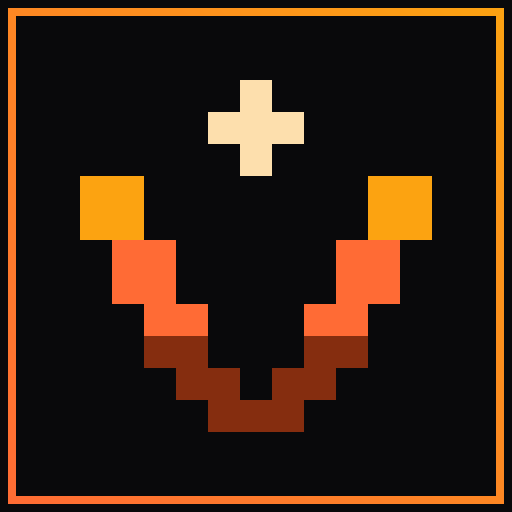
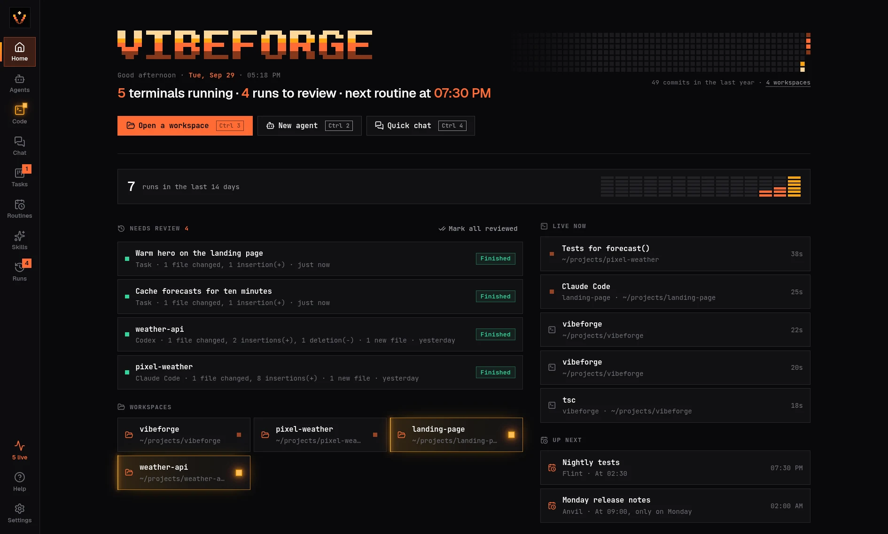

<p align="center">
  
</p>

<h1 align="center">VibeForge</h1>

<p align="center">
  <strong>Your coding agents, forged into one desk.</strong><br>
  An open-source desktop for <a href="https://omarchy.org">Omarchy</a> that runs Claude Code, Codex, Grok and every other coding CLI you already use — in real terminals, as a team.
</p>

<p align="center">
  <a href="https://vibe-forge.net"><strong>vibe-forge.net</strong></a>
</p>

<p align="center">
  <a href="LICENSE"></a>
  
  
</p>

<p align="center">
  
</p>

---

VibeForge never calls a model API and never holds a key. Every engine is a CLI you are already signed in to; VibeForge gives them a home. It remembers **who** does the work (agents with a brief, memory and skills), **where** they may work (allowed folders), **when** work starts (routines), and **what to review** when it ends (every run keeps its final screen, a transcript and the git diff since it began). No accounts. No telemetry. Everything on disk is plain YAML and Markdown.

## Install

On Omarchy (or any Arch + Hyprland setup):

```bash
curl -fsSL https://vibe-forge.net/install | bash
```

Then open **VibeForge** from the app launcher (<kbd>Super</kbd> + <kbd>Space</kbd>) or run `vibeforge`. Add `--uninstall` to remove the launcher (your data stays).

The installer needs `git`, Node 20+ (Omarchy ships mise: `mise use -g node@lts`) and `base-devel` + `python` to build the terminal engine. It clones into `~/.local/share/vibeforge-app`, checks out the newest [release](https://github.com/L0nE-F0x/VibeForge/releases), and adds `~/.local/bin/vibeforge` and a desktop entry. Set `VIBEFORGE_BRANCH=main` to follow the main branch instead.

**Updating.** VibeForge asks GitHub for the newest release number when it starts and every six hours (nothing else is sent; turn it off in Settings → Updates). When one is out, Help in the rail gets a dot: **Update** shows the release notes, runs the installer in a terminal you can watch, then restarts. Running the install command again does the same.

<details>
<summary>Build it yourself</summary>

```bash
git clone https://github.com/L0nE-F0x/VibeForge.git
cd VibeForge
npm install
npm start           # development: Vite + Electron with hot reload
npm run build       # production build, when you want it now
./scripts/vibeforge # builds when this checkout is newer, then opens the window
```

</details>

## What's inside

| View | What it is for |
| --- | --- |
| **Home** | Who is waiting for you, by name, and what is waiting its turn; what's live, what finished and needs review, what fires next, and a year of your commits drawn in pixels. |
| **Agents** | Named teammates with a brief, memory, skills and allowed folders. Chats with an agent are real terminals. Switch its engine from Claude to Codex to Grok and the teammate stays the same. |
| **Code** | A workspace with tiled terminals that you can split, drag to rearrange and maximize, a file tree that inserts paths, and a browser beside them: click an http(s) link in a terminal (your dev server's, say) and it opens there, each workspace keeping its own page. Type `claude`, `codex` or any CLI in a terminal: its title bar says so, and from the moment it starts until you're back at the prompt it is recorded as a run (transcript and git diff). A terminal whose CLI goes quiet or finishes while you're looking elsewhere glows like an ember until you focus it, and so do its workspace and Code's icon in the rail. Looking at one terminal leaves the others glowing. Each title bar says which other coding CLIs are in the same folder. In a split, the terminals you aren't typing in dim a little. Drag workspaces to reorder them and jump between them with <kbd>Alt</kbd>+<kbd>1</kbd>…<kbd>9</kbd>. **Open another branch**, on a workspace's menu, checks that branch out beside the project and opens it as its own workspace. The folder you already have stays on its branch, and removing the new workspace later leaves its folder on disk. Layouts are remembered per workspace. |
| **Chat** | Throwaway conversations in an empty scratch folder. |
| **Tasks** | A board. Writing or assigning a task starts nothing; **Execute** does. A finished run lands in Review with its diff. Turn on **Work in a separate copy** and the agent works in its own git worktree on a `vibeforge/<task>` branch, so it never touches the folder you or another agent are in; **Apply** brings its changes into the workspace as uncommitted edits (conflicts are marked, as a merge would) and removes the copy. In the workspace itself, a task takes turns: while another coding CLI is busy in that folder, Execute waits and starts on its own once that CLI has been quiet for half a minute (or start it now, in a copy or anyway). **Hand off**, on a finished run, makes a To do task for another agent from it. |
| **Routines** | Cron or interval schedules that open a fresh agent run while VibeForge is running, in the tray too. A due routine takes turns like a task: it waits while another coding CLI is busy in its folder. Missed slots are shown, never replayed. |
| **Skills** | Reusable `SKILL.md` procedures you install on agents. |
| **Runs** | Every CLI you typed into a terminal and every process VibeForge started, a day at a time: final screen, transcript, prompt, and the full diff since it began, saved the moment it ended so later edits stay out of it. **Continue** reopens the exact session. Search finds a run by what it said, not only its title: the words around the match are shown, and <kbd>Ctrl</kbd>+<kbd>K</kbd> lists those runs too. |

The pulse at the bottom of the rail counts the terminals running and, underneath, six squares that follow whichever coding plan is closest to its limit. Click it for **plan limits**: each signed-in plan's windows (Claude's 5-hour and 7-day, Grok's credits by product, Kimi's weekly and 5-hour, Codex's and Muse's 5-hour and weekly) with the time until they reset, the last day as a line, and when you'll run out at the current pace. A plan you aren't signed in to stays off the list, and one you sign in to appears on the next refresh. The **Tokens** tab has each CLI's tokens today and this week, read from the logs Claude Code, Codex, Grok Build, Gemini CLI and Muse Code already keep on this machine; nothing is sent anywhere for those.

Plan limits are off until you turn them on in Settings → Usage and activity. VibeForge then asks Anthropic, xAI, Moonshot, OpenAI and Meta, at most every 3 minutes, with the sign-in each CLI already saved on this machine. It reads that sign-in for each request and never renews, rewrites or keeps it; when one has expired, the last numbers stay up until you next open that CLI. Codex's and Muse's limits also come from their own logs, with no network. Only the percentages are saved (`~/.local/share/vibeforge/plans.json`). Settings can also notify you as a window passes 80%, 95% and 100%, once per step until it resets; that's off, since Omarchy's own usage widget may already tell you.

The graph on Home is your commits in your workspaces, read with git. If you'd rather see your GitHub contribution graph, pick **GitHub** in Settings → Usage and activity: VibeForge then asks GitHub for it through the `gh` CLI you're signed in to, at most every 30 minutes, and keeps no token. That's off until you choose it.

It keeps your place. Each view reopens where you left it, the same agent, chat or task with its list scrolled where it was, including after a restart. A half-written message or an unsaved brief, task or skill waits for you until you send it, save it or press **Discard**. <kbd>Ctrl</kbd>+<kbd>K</kbd> (or the logo at the top of the rail) jumps to any agent, chat, workspace, task, routine or skill by typing part of its name, or to a run by something it said. Deleting a chat, task, skill or routine happens at once, with **Undo** on the toast (or <kbd>Ctrl</kbd>+<kbd>Z</kbd>) for a few seconds; only one that is still running asks first.

When an agent or CLI goes quiet while you're looking elsewhere, or sits on a question when it starts (trust this folder? sign in?), it glows until you look: its terminal and workspace in Code, the agent and its chat in Agents, a row under **Waiting for you** on Home, and a dot on the rail. Short tones, made on your machine, say the same: two soft knocks when it's your turn, a rising chime when a task, routine or typed CLI finishes, a lower one when it fails, and a chirp when dictation starts and stops. By default they play only while VibeForge is in the background, never while Omarchy's Do Not Disturb is on (voice aside), and each one can be turned off or previewed in **Settings → Sounds**.

It lives in the tray, next to Steam and the rest in Omarchy's bar (right-click the tray's arrow to pin it to the bar itself). A click opens the window; right-click for sounds, notifications, **Start at login, in the tray**, and Quit. The icon gets an amber corner while something is waiting for you, and the menu lists who, each opening right where it waits. Closing the window leaves VibeForge running there, so terminals keep going and routines keep firing; **Settings → Tray and startup** changes any of that. Start at login adds an entry to `~/.config/autostart`, the same way Omarchy starts other tray apps, and is off until you turn it on.

It looks like the rest of Omarchy: square corners, JetBrains Mono with Geist headings, flat panels and pixel art, with light kept for what's alive: a working CLI is a slow ember, and one waiting for you glows. It wears your Omarchy theme: colours come from the active theme (`colors.toml` plus the ghostty palette for terminals) and change live when you switch themes, pixel wordmark included.

It speaks English, Deutsch, Español, Français, Português (Brasil), 日本語 and 简体中文, following your system language unless you pick one in Settings. The whole window is translated, errors included; the tray menu and its quit question, some desktop notifications, schedule descriptions and git's own summaries are still English. Translations live in `src/ui/i18n/`, one file per language, and the typecheck fails if one is missing a line.

## Works with

Anything with a command line. The defaults know how to hand a first prompt to **Claude Code**, **Codex**, **Grok**, **Cursor Agent**, **Gemini CLI**, **OpenCode** and **Muse** as an argument, and paste it into **Copilot**, **Kimi**, **Crush**, **Pi**, **Hermes** or any other CLI once it's ready. Add your own in Settings or in `~/.config/vibeforge/engines.json`:

```json
{ "id": "claude", "label": "Claude Code", "bin": "claude", "args": [],
  "promptArgs": ["{prompt}"], "continueArgs": ["--continue"] }
```

`args` are always passed. `promptArgs` puts the first message on the command line (`{prompt}` is replaced); leave it out and VibeForge pastes the message once the CLI is ready. `continueArgs` reopens the CLI's latest session in a folder — and when a CLI prints its own resume line on exit (`claude --resume <id>`, `grok --resume <id>`, `codex resume <id>`), **Continue** uses that exact session instead.

## How it works

```
React UI ──IPC──▶ Electron main ──JSON lines──▶ PTY host (system Node)
                  agents, chats, tasks,          node-pty + a headless xterm per
                  routines, runs, scheduler      terminal → your CLIs
```

- **The PTY host** owns every terminal. It mirrors each screen in a headless xterm, so a view that reattaches redraws exactly; it pastes prompts only once a CLI has gone quiet; and when a run ends it writes the final screen, a plain-text transcript and a capped raw scrollback. Stopping hangs up the process group (SIGHUP → SIGTERM → SIGKILL), like closing a terminal window.
- **One writer for run state**: `meta.json` in each run folder plus a SQLite index, with change events pushed to the UI.
- **Login-shell PATH**: VibeForge asks your login shell for `PATH` at start, so CLIs installed with mise or into `~/.local/bin` are found however it was launched.
- **Allowed folders are a policy, not a sandbox.** Runs start inside them and the prompt tells the CLI to stay there, but a coding CLI has a shell.

## Voice

Talk to your agents instead of typing to them, and hear them answer. Everything happens on this machine: [whisper.cpp](https://github.com/ggml-org/whisper.cpp) turns speech into text, [Piper](https://github.com/OHF-Voice/piper1-gpl) reads answers aloud, and no audio leaves your computer or is kept.

```bash
sudo pacman -S whisper-cpp      # listening
uv tool install piper-tts       # talking back (or the AUR's piper-tts-bin)
```

**Dictate.** Hold <kbd>Ctrl</kbd>+<kbd>Shift</kbd>+<kbd>Space</kbd> and speak, then let go (<kbd>Esc</kbd> drops it). The words land in the message box or terminal that has focus, and wait there for you to read and press Enter. Message boxes and Code's toolbar also have a mic: click it, speak for as long as you like, and click it again (or hold it and let go). Code's mic types into the terminal that has focus and hands the keyboard back to it, so Enter sends.

**Hear the answer.** After you send a message you dictated, the first paragraph of the reply is read aloud, in that agent's voice (its Settings tab). Claude Code and Codex answers come from their own session logs. Hold the dictate key to cut an answer short. Settings → Voice can turn this off.

**From anywhere on the desktop.** Hold <kbd>Super</kbd>+<kbd>Alt</kbd>+<kbd>V</kbd> to talk to one agent: the one you pick in Settings → Voice, or the one you last dictated to. The words land in that agent's chat for you to read, and still wait for Enter. Settings → Voice adds the binding to Hyprland for you (or copy it):

```lua
o.bind("SUPER + ALT + V", "VibeForge: hold to talk", "vibeforge --voice start")
o.bind("SUPER + ALT + V", "VibeForge: stop talking", "vibeforge --voice stop", { release = true })
```

`vibeforge --voice start|stop|cancel` reaches the running window over a local socket in a few milliseconds; a short tone marks the start and end while it's in the background. Models (`base.en` is quick, `large-v3-turbo` hears best and knows many languages) and voices download from Hugging Face in Settings → Voice, and ones Omarchy's Voxtype or the AUR's `piper-voices` packages installed are found too. Whisper is told the names of your agents, routines, CLIs and workspace files, so it spells them right.

## Phone

**Settings → Phone** serves a small page for your phone: each workspace and the coding CLIs in it, your plan limits, a CLI's screen, and a box to tell it what to do next. From there you can start an agent, or any CLI on its own, in a workspace; send a prompt; pick a finished session back up with your next instruction; and stop it. A CLI you typed into a terminal is only interrupted (<kbd>Esc</kbd>), so the terminal stays open, and nothing from the phone is ever typed into a terminal that has no CLI running in it.

It is off until you turn it on, and then it listens on `127.0.0.1:4737` only. The page asks once for the pairing code shown in Settings (it's kept in `settings.json`) and remembers it in the phone's browser; **New code** signs every phone out. To reach it from your phone, run [Tailscale](https://tailscale.com) Serve once on this computer:

```sh
tailscale serve --bg --https=443 http://127.0.0.1:4737
```

then open the https address it prints on your phone, signed in to the same tailnet. The page offers to install itself, and the installed page fills the screen. Serve keeps the page inside your tailnet; `tailscale funnel` would put it on the internet, so don't use that. The computer has to stay on and awake with VibeForge running (the tray is enough). While the page is open it buzzes when a CLI starts waiting or finishes; a buzz on a locked phone isn't built yet. Plan limits on the phone are the same numbers as the desktop's and follow the same Settings switch. The page speaks the language VibeForge does, or your phone's when VibeForge follows the system.

## Your files

```
~/.config/vibeforge/            edit anywhere — VibeForge picks up changes live
  agents/<id>/agent.yaml        name, engine, brief, allowed folders, skills
  agents/<id>/memory.md         durable notes added to every run
  skills/<id>/SKILL.md
  routines/<id>.yaml
  tasks/<id>.yaml
  engines.json  settings.json  workspaces.json  layouts/
~/.local/share/vibeforge/
  runs/<stamp>_<slug>/          meta.json, preamble.md, terminal.ansi, transcript.txt, scrollback.txt, git.txt, diff.patch
                                (the last two gzipped once the run has ended; Settings → Storage says how long runs are kept)
  worktrees/<task>/             separate copies for tasks that work in one, until Apply or Discard
  trash/                        deleted chats, tasks, skills and routines, kept 30 s for Undo
  scratch/<chat>/               Chat mode working folders
  models/  voices/              whisper models and Piper voices downloaded in Settings → Voice
```

Override the roots with `VIBEFORGE_CONFIG` and `VIBEFORGE_DATA`. VibeForge's own log is `~/.local/share/vibeforge/logs/vibeforge.log`: what the app did and what went wrong, never prompts or terminal output. **Help → Copy diagnostics** puts your versions, a few settings and its last 200 lines on the clipboard for a bug report.

## Keys

<kbd>Ctrl</kbd>+<kbd>K</kbd> go to anything (<kbd>Ctrl</kbd>+<kbd>Shift</kbd>+<kbd>K</kbd> inside a terminal) · <kbd>Ctrl</kbd>+<kbd>1</kbd>…<kbd>8</kbd> views · <kbd>Alt</kbd>+<kbd>1</kbd>…<kbd>9</kbd> workspaces · <kbd>Ctrl</kbd>+<kbd>,</kbd> settings · <kbd>Alt</kbd>+<kbd>←</kbd>/<kbd>→</kbd> or the mouse's side buttons back and forward · <kbd>↑</kbd>/<kbd>↓</kbd> move through the list you're in · <kbd>Ctrl</kbd>+<kbd>Shift</kbd>+<kbd>B</kbd> collapse the side panel · <kbd>Ctrl</kbd>+<kbd>Shift</kbd>+<kbd>D</kbd>/<kbd>E</kbd> new terminal right/below · <kbd>Ctrl</kbd>+<kbd>Shift</kbd>+<kbd>W</kbd> close it · <kbd>Ctrl</kbd>+<kbd>Shift</kbd>+<kbd>M</kbd> maximize the focused pane · <kbd>Ctrl</kbd>+<kbd>Shift</kbd>+<kbd>/</kbd> every shortcut · <kbd>Ctrl</kbd>+<kbd>S</kbd> save · <kbd>Ctrl</kbd>+<kbd>Z</kbd> undo a delete while its toast is up · <kbd>Esc</kbd> close · <kbd>Ctrl</kbd>+<kbd>Shift</kbd>+<kbd>Space</kbd> dictate (hold, then let go) · in terminals <kbd>Ctrl</kbd>+<kbd>C</kbd> copies the selection (with nothing selected it interrupts the program) and <kbd>Ctrl</kbd>+<kbd>V</kbd> pastes (an image on its own goes to the program, so Claude Code can paste it); Omarchy's <kbd>Super</kbd>+<kbd>C</kbd>/<kbd>V</kbd>, <kbd>Ctrl</kbd>+<kbd>Insert</kbd>/<kbd>Shift</kbd>+<kbd>Insert</kbd> and <kbd>Ctrl</kbd>+<kbd>Shift</kbd>+<kbd>C</kbd>/<kbd>V</kbd> work too · drop files on a terminal to insert their paths.

In Code, drag a pane by its title bar onto another pane: the middle swaps them, an edge docks it on that side. Double-click a title bar to maximize. Right-click a view in the rail to hide it; **Settings → Rail** shows it again and sets the order. Side panels resize from their edge and collapse to a strip. **Help** in the rail replays the welcome tour, checks for updates, copies diagnostics, and opens bug reports and feature ideas as GitHub issues with your versions filled in; nothing is sent from the app.

## Develop

```bash
npm test            # unit tests + the real PTY host driven with /bin/bash (never a model CLI)
npm run typecheck
npm run lint        # Biome, bug-shaped rules only
npm run coverage    # the tests with coverage; src/core keeps 85% of its lines covered
npm run build && npm run smoke    # the built app: every view, a language switch, Ctrl+K and a shell
                                  # (SMOKE_HEADLESS=1 draws no window; CI runs it under xvfb)
```

The code is in `src/core` (the service, storage, scheduler — plain Node), `src/ui` (React) and `electron/` (main process, preload, PTY host). The pixel font, mark and pixel fields live in `src/shared/pixel.ts`; `node scripts/brand.ts` regenerates the icon, the website's inline pixel art and the social image from it. The website is plain HTML/CSS/JS in `site/` and deploys to Netlify from `netlify.toml` with no build step; preview it with `python3 -m http.server -d site`. `docs/original-brief.md` is the product brief VibeForge grew from; `docs/status.md` says what has been verified.

---

VibeForge is an independent project. It is not affiliated with Omarchy, Anthropic, OpenAI, xAI, Google, Meta, Moonshot, GitHub, Tailscale or any CLI it runs; their names are used only to say what VibeForge works with. Released under the [MIT license](LICENSE).

Contributing notes are in [CONTRIBUTING.md](CONTRIBUTING.md). Everyone here follows the [code of conduct](CODE_OF_CONDUCT.md).
